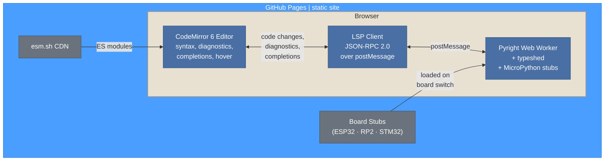
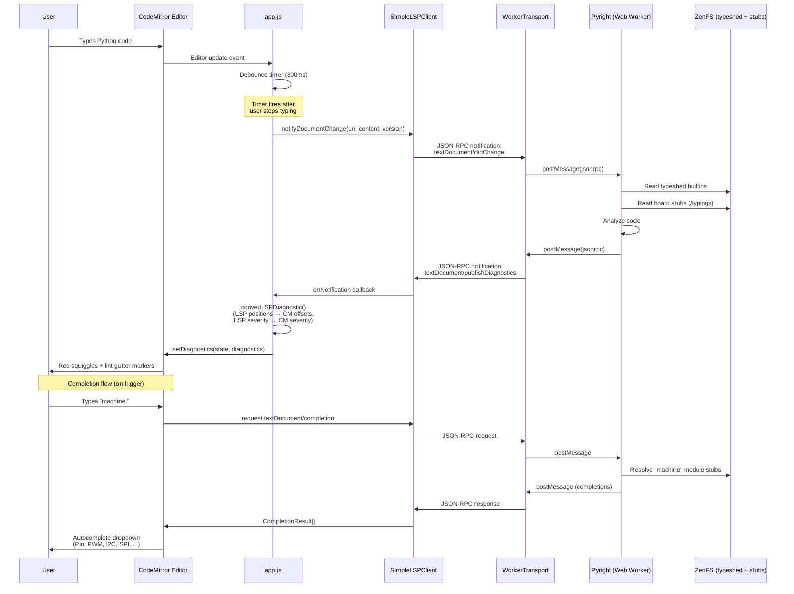
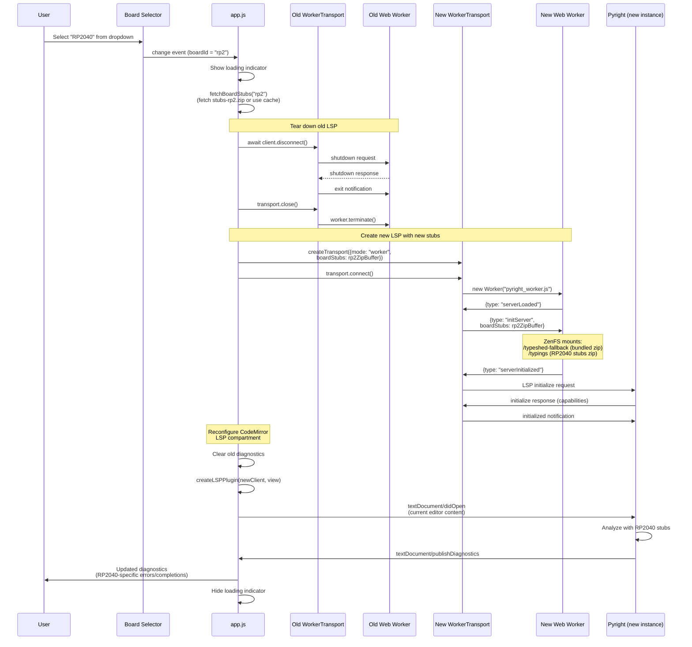
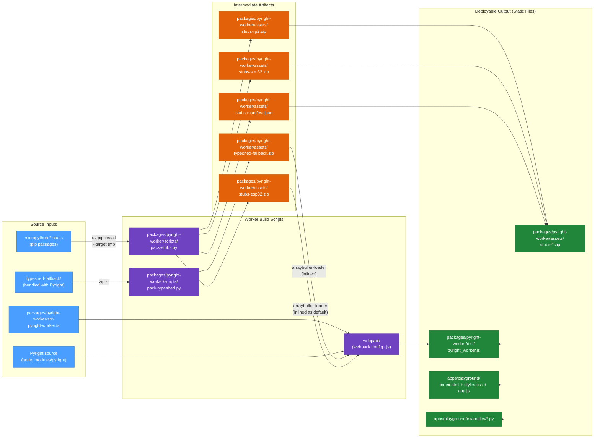

# Architecture

This document describes the architecture of the MicroPython CodeMirror Editor — a static HTML5 page that runs Pyright as an LSP server entirely in the browser via a Web Worker, providing real-time diagnostics, autocompletion, and hover tooltips for MicroPython code. The page is deployable to GitHub Pages with zero server-side dependencies.

## Component Overview

Everything runs in the browser. CodeMirror handles the editing UI, an LSP client bridges it to Pyright running in a Web Worker, and Pyright uses bundled type stubs to understand MicroPython code.



For implementation details, see `packages/lsp-client/src/` (client layer),
`packages/pyright-worker/src/pyright-worker.ts` (worker entry), and
`apps/playground/app.js` (editor setup and board switching).

The playground imports reusable APIs only through
`apps/playground/component-source.js`. The `components=local|cdn` query parameter makes
that boundary resolve either workspace package files or immutable jsDelivr tags, so both
modes exercise the same application.

## LSP Communication Flow

When the user types code in the editor, changes are debounced and sent to Pyright via the LSP protocol over `postMessage`. Pyright analyzes the code against typeshed and board stubs, then pushes diagnostics back. The LSP client maps these to CodeMirror lint markers that appear as red squiggles.



## Board Switch Flow

When the user selects a different board (e.g., ESP32 → RP2040), the current worker is terminated and a new one is created with the target board's stubs. The LSP lifecycle restarts from scratch — initialize, open document, and diagnostics refresh.



## Build Pipeline

The build process bundles Pyright, typeshed, and default board stubs into a single worker JS file. Board stub zips are also produced as separate files for on-demand loading.



**Key details:**
- **typeshed-fallback.zip**, **stubs-stdlib.zip**, and **stubs-rp2.zip** are currently inlined into the worker bundle via `arraybuffer-loader`. New clients explicitly select a board source or start without board stubs; the inlined RP2 archive is retained only for published legacy clients that sent an undefined board selection.
- Sidecar board archives are available for explicit selection without rebuilding the worker.
- The webpack config targets `webworker`, polyfills Node APIs (fs → ZenFS, path, crypto, etc.), and uses `ts-loader` in transpile-only mode.
- `fs` is aliased to `@zenfs/core` so Pyright's filesystem calls work against the in-browser virtual filesystem.

## Accepted Runtime and Asset Evolution

The architecture review in `stubs_playground-bvk` was accepted on 2026-08-31.
The goal is to update the worker runtime and stub metadata without coupling every
change to a ViperIDE rebuild, while keeping the design static-hosting friendly
and backward compatible.

### Component boundaries

| Component | Ownership and release policy |
|---|---|
| `@mp-typing/lsp-client` | Stable CodeMirror integration and worker control-plane client. Independently versioned on npm. |
| Pyright, compatible typeshed, ZenFS integration, and worker glue | One tested runtime release unit. Pyright and typeshed must not be selected independently. |
| Runtime manifest | Small versioned JSON document describing an immutable worker runtime, protocol range, capabilities, integrity, and compatible assets. Generated by the worker release. |
| Stub-package catalog | Independently publishable JSON metadata. A validated external catalog may replace the snapshot bundled with the worker. |
| Board and fallback archives | Immutable sidecar assets identified by URL, byte size, package version, and SHA-256 digest. The worker retains bundled fallbacks for offline startup and rollback. |
| Runtime PyPI stub wheels | Continue to be discovered, validated, installed, and cached independently through the existing worker API and IndexedDB store. |
| Client-defined stub overlays | Owned by the host application, not the shared runtime manifest. A host may provide additional type-only packages or validated archives and add their mount paths to Pyright. |

No additional npm package is introduced initially. The runtime manifest, catalog,
and archives are deployable files within the worker release infrastructure. A
separate loader package should be considered only if a non-CodeMirror consumer
needs the same control plane.

### Loading and version authority

The selected model is a **host-selected classic worker runtime**:

1. The host may fetch a configured runtime manifest.
2. The host validates its schema, supported control-protocol range, asset origins,
   sizes, and SHA-256 digests.
3. The host starts the immutable classic worker selected by that manifest.
4. The loader and worker negotiate the control-protocol version and optional
   capabilities before `initServer`.
5. If selection, download, integrity, or startup fails, the host tries its cached
   last-known-good manifest/runtime and then its same-origin bundled runtime.

The host application owns the manifest URL and update policy. The worker must not
self-update. An exact bundled npm worker remains the deterministic offline and
rollback baseline.

Classic workers are retained because they support the existing same-origin build
and Blob/`importScripts` CDN paths. Moving to module workers does not solve version
selection and would add migration risk. Loading Pyright separately from typeshed
is rejected because it permits untested combinations. A service-worker updater is
also rejected as unnecessary for this scope.

### Control-plane compatibility

The worker startup message will add a protocol version and capability list:

```js
{
  type: "serverLoaded",
  protocolVersion: 2,
  capabilities: [
    "externalCatalog",
    "externalStubArchives",
    "runtimeStubPackages"
  ]
}
```

The loader treats an absent `protocolVersion` as legacy version 1. It must reject
an unsupported version before sending `initServer`, with an actionable error.
Optional operations are used only when advertised. LSP JSON-RPC traffic remains
standard LSP traffic after the worker-specific startup handshake.

LSP shutdown will use the standard sequence: send the `shutdown` request, await
its response within a bounded timeout, send `exit`, and then close the transport.
Forced worker termination remains available for failed or unresponsive runtimes.

### Runtime manifest contract

`runtime-manifest.json` is generated and tested as part of a worker release. It
contains at least:

- manifest schema version and immutable runtime identifier;
- worker URL, byte size, and SHA-256 digest;
- Pyright version and the compatible typeshed identity;
- supported control-protocol range and capabilities;
- catalog URL, schema version, size, and SHA-256 digest;
- fallback archive URLs, package identities and versions, sizes, and SHA-256 digests.

Cache keys include the absolute URL and declared SHA-256 digest. A changed digest
therefore creates a new cache entry rather than mutating trusted cached content.
Only HTTPS resources are accepted, except HTTP on loopback during development.
Redirects are rejected because browser workers cannot inspect every intermediate
redirect origin. Downloads remain size-bounded, and no asset is used before its
digest is verified. External catalogs must use schema version `2.0`.

The external catalog and archives are optional. Their bundled snapshots remain
the failure fallback. Invalid, incompatible, or unverifiable external content
is reported through `serverInitialized.assetFallbacks` and triggers the
documented fallback chain; it is never silently treated as current content.
Client-owned overlay archives have no shared fallback and therefore fail worker
initialization when validation or safe type-only extraction fails.

### Client-defined stub overlays

Client-specific packages such as ViperIDE's `viper-tools-stubs` do not belong
in the shared runtime manifest or worker package. A reusable backend must not
build, select, publish, or bundle wheels for its clients.

| Responsibility | Owner |
|---|---|
| Author and test client-specific stubs | Stub-package maintainer |
| Build or obtain a versioned type-only wheel or ZIP | Host application or its release process |
| Select the overlay version and decide whether it is enabled | Host application |
| Publish or bundle the archive and provide its URL/data, size, digest, and allowed origins | Host application |
| Forward the generic `extraStubArchives` configuration | `@mp-typing/lsp-client` |
| Validate integrity, reject runtime Python and unsafe paths, and mount accepted type information | `@mp-typing/pyright-worker` |
| Present settings, failures, and retry/update policy | Host application |

The dependency direction is one-way: a host supplies an archive through the
generic API, while the reusable client and worker know only the archive
contract. Shared worker releases contain no ViperIDE package name, version,
descriptor, build step, or artifact. Adding another host-specific overlay must
therefore require changes only in that host and its stub-package release process.

For ViperIDE, ViperIDE ships its selected type-only wheel and integrity
metadata, then passes the resulting descriptor through `extraStubArchives` as
a client-owned overlay. The worker validates its size and digest, extracts only
type information, mounts it under `/extra/viper-tools-stubs`, and adds that
mount to Pyright's search paths. Updating the package does not require rebuilding
the Pyright worker.

The generic API also accepts another host's verified ZIP or wheel by URL or
`ArrayBuffer`. The existing `extraStubPackages` files API remains supported.

### Migration sequence

1. Remove the conflicting implicit default board and implement compliant LSP shutdown.
2. Add protocol-version and capability negotiation while preserving legacy v1 workers.
3. Generate `runtime-manifest.json` during worker releases.
4. Accept a validated external catalog and hashed fallback archives.
5. Add optional remote runtime selection with cached last-known-good and bundled fallback.
6. Migrate the Playground and verify both bundled and remotely selected startup.
7. Migrate ViperIDE after the Playground path is proven.

Existing `@mp-typing/pyright-worker` consumers remain supported throughout
the migration. Omitting a runtime-manifest URL keeps the current same-origin
package flow. New loader releases must continue to start legacy v1 workers until
that compatibility path is explicitly deprecated in a later major release.

### Required validation

Tests cover package-level schema and protocol behavior, browser startup, legacy
and current protocol versions, incompatible version rejection, corrupt and
oversized assets, cache hits, offline startup, last-known-good rollback, bundled
fallback, external catalog failure, client-defined overlays, and Playground and
ViperIDE migration. Pyright/typeshed combinations are tested only as complete
runtime units.
