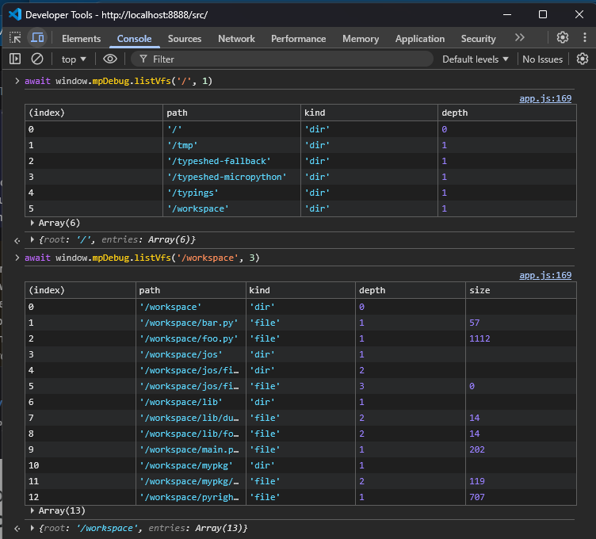

# Technical Documentation: CDN-Based CodeMirror 6 with Python Support

## Problem: Version Conflicts in CDN Loading

When loading CodeMirror 6 packages from a CDN using ES modules, a common issue arises:

```
Error: Unrecognized extension value in extension set ([object Object]). 
This sometimes happens because multiple instances of @codemirror/state are loaded, 
breaking instanceof checks.
```

### Root Cause

CodeMirror 6 is distributed as a collection of separate packages with interdependencies:
- `codemirror` (meta-package) depends on `@codemirror/state`, `@codemirror/view`, etc.
- `@codemirror/lang-python` depends on `@codemirror/language`, `@codemirror/state`, etc.
- Each package specifies version ranges (e.g., `^6.0.0`) for its dependencies

When loading from a CDN without explicit version pinning, the CDN may resolve these ranges to different concrete versions:
- `codemirror@6.0.1` might load `@codemirror/state@6.5.2`
- `@codemirror/lang-python@6.1.6` might load `@codemirror/state@6.4.1`

This causes multiple versions of the same package to be loaded in the browser, breaking CodeMirror's internal `instanceof` checks and causing the error.

## Solution: Explicit Dependency Pinning with esm.sh

We use [esm.sh](https://esm.sh/)'s `?deps=` parameter to explicitly pin all shared dependencies to the same versions across all packages.

### Implementation

In `src/index.html`, we define an import map with explicit dependencies:

```html
<script type="importmap">
{
    "imports": {
        "codemirror": "https://esm.sh/codemirror@6.0.1?deps=@codemirror/state@6.4.1,@codemirror/view@6.35.0,@codemirror/language@6.10.6,@codemirror/autocomplete@6.18.3,@lezer/common@1.2.3",
        "@codemirror/lang-python": "https://esm.sh/@codemirror/lang-python@6.1.6?deps=@codemirror/autocomplete@6.18.3,@codemirror/language@6.10.6,@codemirror/state@6.4.1,@codemirror/view@6.35.0,@lezer/common@1.2.3,@lezer/python@1.1.16"
    }
}
</script>
```

### How It Works

1. **Both packages specify the same versions for shared dependencies:**
   - `@codemirror/state@6.4.1`
   - `@codemirror/view@6.35.0`
   - `@codemirror/language@6.10.6`
   - `@codemirror/autocomplete@6.18.3`
   - `@lezer/common@1.2.3`

2. **esm.sh respects these pinned versions** when resolving transitive dependencies

3. **Only one version of each package is loaded** in the browser

### Verification

You can verify this works by:

1. **Checking the browser console** - should show no errors
2. **Inspecting network requests** - look for the unique hash in URLs like:
   ```
   /X-ZEBjb2RlbWlycm9yL3N0YXRlQDYuNC4x/
   ```
   This hash (base64 encoded) represents the dependency specification. All packages with the same deps will use the same cached bundle.

3. **Testing functionality:**
   - Python syntax highlighting should work
   - Editor should accept input
   - All buttons should function correctly
   - No console errors

## Alternative Approaches

### 1. Import Map with Manual Package Entries
Defining each package separately in the import map:
```javascript
{
  "imports": {
    "@codemirror/state": "https://esm.sh/@codemirror/state@6.4.1",
    "@codemirror/view": "https://esm.sh/@codemirror/view@6.35.0",
    // ... more packages
  }
}
```
**Issues:** 
- Very verbose (dozens of packages)
- Transitive dependencies still cause issues
- Hard to maintain

### 2. Using Bundle/Standalone Mode
Using `?bundle` or `?standalone` flags:
```javascript
"https://esm.sh/@codemirror/lang-python@6.1.6?standalone"
```
**Issues:**
- Creates large bundle files
- Duplicates code when using multiple packages
- Still doesn't solve version conflicts with the base `codemirror` package

### 3. Using Different CDN Providers
Options: jspm.dev, unpkg, cdn.jsdelivr.net, cdn.skypack.dev
**Issues:**
- Same fundamental problem with version resolution
- Some CDNs don't support import maps well
- esm.sh has the best `?deps=` parameter support

### 4. Local Bundling with Vite/Rollup
Using a build tool to bundle everything:
**Issues:**
- More complex development workflow
- Orthrogonal to the purpose of this PoC

## Best Practices for CDN-Based CodeMirror

### 1. Pin All Versions Explicitly
Never use version ranges in import maps:
```javascript
// ❌ Bad - uses latest compatible version
"codemirror": "https://esm.sh/codemirror@^6.0.0"

// ✅ Good - explicit version
"codemirror": "https://esm.sh/codemirror@6.0.1"
```

### 2. Use Consistent Dependency Versions
When adding new CodeMirror extensions, use the same dependency versions:
```javascript
// When adding @codemirror/lang-javascript
"@codemirror/lang-javascript": "https://esm.sh/@codemirror/lang-javascript@6.2.2?deps=@codemirror/state@6.4.1,@codemirror/view@6.35.0,..."
```

## Debugging Version Conflicts

If you encounter version conflict errors:

1. **Open browser DevTools Network tab**
2. **Filter for `@codemirror` requests**
3. **Look for duplicate packages** - multiple URLs with different version numbers
4. **Check the `/X-` hash in URLs** - different hashes mean different dependency sets
5. **Update import map** to use consistent versions across all packages

### Common Error Patterns

```
Unrecognized extension value
→ Multiple @codemirror/state versions loaded

TypeError: Cannot read property 'from' of undefined  
→ Version mismatch between @codemirror/state and @codemirror/view

Extension value must be an extension
→ Package loaded from wrong version, doesn't match expected interface
```

## Performance Considerations

### HTTP/2 Multiplexing
Modern browsers use HTTP/2, so loading multiple small modules is efficient. The CDN approach:
- Loads only what's needed
- Caches individual packages
- Benefits from browser/CDN caching

### Bundle Size
With explicit dependency pinning:
- Total transfer: ~450KB (minified)
- Gzipped: ~150KB
- Cached after first load

### Loading Time
Typical loading sequence:
1. HTML loads (< 1KB)
2. Import map parsed immediately
3. app.js loads and starts importing (5KB)
4. Parallel loading of CodeMirror packages (~300ms on good connection)
5. Editor initializes and renders (~50ms)

Total time to interactive: **< 500ms** on typical connections

## Future Improvements

### 1. Preload Hints
Add `<link rel="modulepreload">` for faster loading:
```html
<link rel="modulepreload" href="https://esm.sh/codemirror@6.0.1?deps=...">
<link rel="modulepreload" href="https://esm.sh/@codemirror/lang-python@6.1.6?deps=...">
```

### 2. Web Worker Caching
The Pyright Web Worker bundles typeshed and stubs into the worker itself, so no additional caching strategy is needed for LSP data.

### 3. Lazy Loading Language Modes
Load Python support only when needed (but that is most of the times anyway) :
```javascript
const python = await import('@codemirror/lang-python');
view.dispatch({
  effects: StateEffect.appendConfig.of(python.python())
});
```

### 4. Version Automation
Create a script to check for compatible CodeMirror package versions:
```bash
# Check what versions work together
node scripts/check-versions.js
```

## LSP Client Architecture

### Overview

This project implements a **custom LSP (Language Server Protocol) client** for CodeMirror because there is no stable `@codemirror/lsp-client` package available. The LSP integration enables real-time Python type checking via Pyright.

### Architecture Diagram

```
┌─────────────────┐
│    app.js       │ ← Application layer
└────────┬────────┘
         │
┌────────▼────────┐
│   client.js     │ ← LSP client factory/configuration
└────────┬────────┘
         │
         ├──────────────┬──────────────────────┬─────────────────┐
         │              │                      │                 │
┌────────▼──────────┐  ┌▼──────────────────┐  ┌▼─────────────┐  ┌▼──────────────┐
│ simple-client.js  │  │ transport-         │  │diagnostics.js│  │ completion.js │
│ (LSP Protocol)    │  │ factory.js         │  │(CodeMirror)  │  │ hover.js      │
└───────────────────┘  └────────┬───────────┘  └──────────────┘  └───────────────┘
                                │
                    ┌───────────┴───────────┐
                    │                       │
          ┌────────▼─────────┐   ┌──────────▼──────────┐
          │ worker-           │   │ websocket-           │
          │ transport.js      │   │ transport.js         │
          │ (default)         │   │ (fallback)           │
          └────────┬──────────┘   └──────────────────────┘
                   │
          ┌────────▼──────────┐
          │  Pyright Worker   │
          │  (dist/pyright_worker.js) │
          │  In-browser       │
          └───────────────────┘
```

### Transport Selection

The transport is selected at runtime by `transport-factory.js`:
- **Default (worker):** Pyright runs in a Web Worker (`dist/pyright_worker.js`). No server needed. Used in production and GitHub Pages.
- **WebSocket:** Available as a transport option but requires an external LSP server.

### Component Responsibilities

#### `simple-client.js` - LSP Protocol Implementation

**Purpose:** Implements the LSP protocol (JSON-RPC 2.0) independently of transport mechanism.

**Key Features:**
- **Protocol Handshake:** Handles `initialize` → `initialized` sequence
- **Request/Response:** Manages message IDs, timeouts, and promise-based responses
- **Notifications:** Sends and receives notifications (no response expected)
- **Transport-Agnostic:** Works with any transport (WebSocket, stdio, etc.)

**Core Methods:**
```javascript
class SimpleLSPClient {
  async connect(transport)      // Connect to transport and initialize
  async initialize()             // Send initialize request to server
  request(method, params)        // Send request, wait for response
  notify(method, params)         // Send notification (fire-and-forget)
  handleMessage(messageStr)      // Parse and route incoming messages
  onNotification(handler)        // Register notification handlers
  disconnect()                   // Clean shutdown
}
```

**Example Usage:**
```javascript
const client = new SimpleLSPClient({
  rootUri: 'file:///workspace',
  timeout: 5000
});

// Request diagnostics
const diagnostics = await client.request('textDocument/diagnostic', {
  textDocument: { uri: 'file:///workspace/document.py' }
});

// Send document change notification
client.notify('textDocument/didChange', {
  textDocument: { uri: 'file:///workspace/document.py', version: 2 },
  contentChanges: [{ text: 'import machine\n' }]
});
```

#### `client.js` - Factory and Configuration

**Purpose:** Creates and configures LSP client with the Web Worker transport.

**Key Features:**
- Simplified API for creating LSP client
- Async initialization with proper error handling

**Example:**
```javascript
const { client, transport } = await createLSPClient({
  workerUrl: '../dist/pyright_worker.js'
});
```

#### `diagnostics.js` - CodeMirror Integration

**Purpose:** Bridges LSP diagnostics with CodeMirror's UI.

**Key Features:**
- Converts LSP diagnostics to CodeMirror lint format
- Displays error/warning underlines in editor
- Provides hover tooltips with error messages
- Sends document lifecycle notifications (open, change, close)

**Core Functions:**
```javascript
createLSPDiagnostics(client)              // Create CodeMirror diagnostics extension
notifyDocumentOpen(client, uri, text)     // Send textDocument/didOpen
notifyDocumentChange(client, uri, text, version) // Send textDocument/didChange
notifyDocumentClose(client, uri)          // Send textDocument/didClose
```

### LSP Message Flow

#### Initialization Sequence
```
Browser                SimpleLSPClient         WorkerTransport         Pyright Worker
   │                          │                        │                     │
   │  createLSPClient()       │                        │                     │
   ├─────────────────────────>│                        │                     │
   │                          │  connect()             │                     │
   │                          ├───────────────────────>│  new WebSocket()    │
   │                          │                        ├────────────────────>│
   │                          │                        │     Connected       │
   │                          │                        │<────────────────────│
   │                          │  initialize request    │                     │
   │                          ├───────────────────────>│  {method:"initialize"}
   │                          │                        ├────────────────────>│
   │                          │                        │  {result:{capabilities}}
   │                          │                        │<────────────────────│
   │                          │  initialized notify    │                     │
   │                          ├───────────────────────>│  {method:"initialized"}
   │                          │                        ├────────────────────>│
   │  {client, transport}     │                        │                     │
   │<─────────────────────────│                        │                     │
```

#### Real-Time Diagnostics Flow (Sprint 3) ✅
```
User types          app.js              diagnostics.js      SimpleLSPClient      Pyright
in editor
   │                  │                       │                   │                │
   │  Keystroke       │ createUpdateListener()│                   │                │
   ├─────────────────>│ (debounce 300ms)      │                   │                │
   │  Keystroke       │  ...waiting...        │                   │                │
   ├─────────────────>│  ...waiting...        │                   │                │
   │  (pause 300ms)   │                       │                   │                │
   │                  │ Trigger update        │                   │                │
   │                  ├──────────────────────>│ notifyDocumentChange()             │
   │                  │                       ├──────────────────>│ notify()       │
   │                  │                       │                   ├───────────────>│
   │                  │                       │                   │  Analyze code  │
   │                  │                       │                   │<───────────────│
   │                  │                       │                   │ publishDiagnostics
   │                  │                       │<──────────────────│                │
   │                  │                       │ Display errors    │                │
   │                  │<──────────────────────│ (red underlines)  │                │
```

**Key Features:**
- **300ms Debounce:** Prevents excessive updates during rapid typing
- **Document Versioning:** Increments `documentVersion` with each change
- **Efficient Updates:** Only sends changes after user pauses typing
- **Automatic Clearing:** Errors disappear when fixed

#### Type Check Flow (Manual Button Click)
```
User clicks         app.js              diagnostics.js      SimpleLSPClient      Pyright
"Type Check"
   │                  │                       │                   │                │
   │  Click event     │                       │                   │                │
   ├─────────────────>│ triggerTypeCheck()    │                   │                │
   │                  ├──────────────────────>│ notifyDocumentChange()             │
   │                  │                       ├──────────────────>│ notify()       │
   │                  │                       │                   ├───────────────>│
   │                  │                       │                   │  Analyze code  │
   │                  │                       │                   │<───────────────│
   │                  │                       │                   │ publishDiagnostics
   │                  │                       │<──────────────────│                │
   │                  │                       │ Display errors    │                │
   │                  │<──────────────────────│                   │                │
```

### Why Custom Implementation?

**No Official CodeMirror LSP Package:**
- `@codemirror/lsp-client` doesn't exist as a **stable** package
- Other LSP client libraries (like `vscode-languageclient`) are designed for VS Code, not browsers

**Custom Implementation Benefits:**
- **Lightweight:** Only implements needed LSP features (~200 lines)
- **CodeMirror-Optimized:** Direct integration with CodeMirror's extension system
- **Flexible:** Easy to add new LSP features as needed
- **No Dependencies:** Pure JavaScript, works in any modern browser

**What We Implement:**
- ✅ `initialize` / `initialized` handshake
- ✅ `textDocument/didOpen` notification
- ✅ `textDocument/didChange` notification (with 300ms debouncing)
- ✅ `textDocument/diagnostic` request
- ✅ `textDocument/publishDiagnostics` notification handling
- ✅ Real-time diagnostics with automatic updates
- ✅ Document version tracking
- ⏳ `textDocument/completion`
- ⏳ `textDocument/hover`

### Testing the LSP Client

**Verify Connection:**
1. Open browser DevTools console
2. Look for LSP client initialization messages
3. Check server capabilities: `client.serverCapabilities`

**Test Type Checking:**
1. Load an example with `machine` import (should show error)
2. Click "🔍 Type Check" button
3. Verify red underline appears under `machine`
4. Hover to see error message: `"machine" is not a known module`

**Debug Mode:**
```javascript
// In browser console
lspClient.onNotification((method, params) => {
  console.log('LSP Notification:', method, params);
});
```

### Error Handling

**Connection Failures:**
- WebSocket connection errors are thrown by `createLSPClient()`
- Application shows error message: "Failed to connect to LSP server"
- No fallback to mock (production-only behavior since mock removal)

**Request Timeouts:**
- Default timeout: 5 seconds
- Configurable via `SimpleLSPClient` constructor
- Timeout errors reject the promise returned by `request()`

**Server Errors:**
- LSP error responses are converted to JavaScript errors
- Error messages are logged to console
- CodeMirror displays error state in editor

### Future Enhancements

**Add functionality**
- 📝 Incremental sync for large documents (deferred to performance optimization phase)
- ⏳ Go to definition (`textDocument/definition`)
- ⏳ Find references (`textDocument/references`)
- ⏳ Signature help (`textDocument/signatureHelp`)

**Performance Optimizations** 
- Message batching for multiple rapid changes
- Incremental document sync (send diffs, not full text)
- Web Worker for message processing
- Completion result caching

## LSP Autocompletion Architecture 

### Overview

Sprint 4 added LSP-powered autocompletion using Pyright's `textDocument/completion` capability. The implementation integrates with CodeMirror's autocomplete system to provide intelligent completion suggestions.

### Component Structure

```
┌─────────────────┐
│   client.js     │ ← Creates completion extension
└────────┬────────┘
         │
┌────────▼────────┐
│ completion.js   │ ← LSP completion source
└────────┬────────┘
         │
         ├─────────────────┬──────────────────┐
         │                 │                  │
┌────────▼──────────┐  ┌──▼───────────┐  ┌──▼─────────────┐
│ CompletionItem    │  │ Position     │  │ Format         │
│ Kind Mapping      │  │ Calculation  │  │ Conversion     │
└───────────────────┘  └──────────────┘  └────────────────┘
```

### Completion Flow

```
User types        completion.js       SimpleLSPClient      Pyright
"sys."
   │                    │                   │                │
   │  Trigger           │                   │                │
   ├───────────────────>│ Check context     │                │
   │                    │ (explicit/typing) │                │
   │                    │ Match word pattern│                │
   │                    │ Calculate position│                │
   │                    ├──────────────────>│ request()      │
   │                    │                   ├───────────────>│
   │                    │                   │  Analyze types │
   │                    │                   │<───────────────│
   │                    │                   │ {items:[...96]}│
   │                    │<──────────────────│                │
   │                    │ Convert LSP→CM    │                │
   │                    │ format            │                │
   │  Display menu      │                   │                │
   │<───────────────────│ {from, options[]} │                │
```

### Key Implementation Details

#### 1. Context-Aware Position Calculation

**The Critical Insight:** Completion starting position depends on context.

```javascript
// Word completion: "impor" → complete from start of word
text = "impor"
word.from = 0, word.to = 5, cursor = 5
from = word.from (0)  // Replace "impor" with "import"

// Attribute access: "sys." → complete after dot
text = "sys."
word.from = 0, word.to = 4, cursor = 4
from = cursor (4)     // Insert after "sys.", don't replace it
```

**Implementation:**
```javascript
// Determine starting position based on word ending
const from = word.text.endsWith('.') ? pos : word.from;
```

This simple check enables both:
- **Word replacement** for regular completions
- **Attribute insertion** for method/property access

#### 2. LSP to CodeMirror Format Conversion

**LSP CompletionItem Format:**
```json
{
  "label": "__name__",
  "kind": 6,
  "detail": "str",
  "documentation": "The module name"
}
```

**CodeMirror Completion Format:**
```javascript
{
  label: "__name__",
  type: "variable",
  detail: "str",
  info: "The module name",
  apply: "__name__"
}
```

**Kind Mapping (LSP → CodeMirror):**
```javascript
const kindToType = {
  1: 'text',        // Text
  2: 'function',    // Method
  3: 'function',    // Function
  4: 'function',    // Constructor
  5: 'property',    // Field
  6: 'variable',    // Variable
  7: 'class',       // Class
  8: 'interface',   // Interface
  9: 'namespace',   // Module
  10: 'property',   // Property
  // ... etc
};
```

#### 3. Trigger Conditions

**Automatic Trigger (typing):**
```javascript
// Only trigger if we have a word match
const word = context.matchBefore(/[\w\.]+/);
if (!word || (word.from === word.to && !context.explicit)) {
    return null;  // Don't show completions
}
```

**Manual Trigger (Ctrl+Space):**
```javascript
// Always show if explicitly requested
if (context.explicit) {
    // Force completion even with syntax errors
}
```

#### 4. Integration with CodeMirror

**In `client.js`:**
```javascript
import { autocompletion } from '@codemirror/autocomplete';
import { createCompletionSource } from './completion.js';

const completionSource = createCompletionSource(client, fileUri);

const completionExtension = autocompletion({
    override: [completionSource],  // Replace default completions
    activateOnTyping: true,        // Show on typing
    maxRenderedOptions: 100,       // Limit UI display
    defaultKeymap: true            // Enable Ctrl+Space
});
```

**Why `override`?**
- Replaces CodeMirror's default word-based completions
- Ensures only LSP completions are shown
- Prevents confusion from mixed completion sources

### Test Coverage

**Scenarios Tested:**
1. **Python stdlib:** `sys.` → 96 completions (platform, argv, exit, etc.)
2. **Import statements:** `import o` → 92 modules (os, opcode, operator, etc.)
3. **String methods:** `"text".` → 85 methods (upper, lower, split, etc.)
4. **MicroPython:** `pin.` → 54 items (on, off, toggle, IRQ constants)

### Common Issues & Solutions

#### Issue 1: Empty Results on Syntax Errors

**Symptom:** Typing `sys.` shows no completions automatically.

**Cause:** Pyright returns empty results for incomplete code in automatic mode.

**Solution:** Always works with explicit trigger (Ctrl+Space). This is expected behavior.

### Performance Characteristics

**Latency:**
- LSP request: ~50-100ms (local WebSocket)
- Format conversion: ~5ms (96 items)
- UI rendering: ~10ms (CodeMirror)
- **Total:** ~65-115ms from trigger to display

### File Structure

```
src/lsp/
├── completion.js          (159 lines)
│   ├── CompletionItemKind enum
│   ├── kindToType() converter
│   ├── convertCompletionItem()
│   └── createCompletionSource()
├── client.js              (modified)
│   └── Adds completion extension
└── simple-client.js       (existing)
    └── Handles LSP requests
```

### Future Enhancements

**Completion Features:**
- [ ] Snippet support for function calls with placeholders
- [ ] Documentation preview in completion info
- [ ] Completion ranking/sorting by relevance
- [ ] Completion result caching
- [ ] Fuzzy matching for filtering

**LSP Features:**
- [ ] `completionItem/resolve` for additional details
- [ ] Signature help during function calls
- [ ] Trigger character configuration

## LSP Hover Tooltips Architecture 

### Overview

Adds LSP-powered hover tooltips using Pyright's `textDocument/hover` capability. The implementation integrates with CodeMirror's `hoverTooltip` extension to display rich documentation on mouse hover.

### Component Structure

```
┌─────────────────┐
│   client.js     │ ← Creates hover extension
└────────┬────────┘
         │
┌────────▼────────┐
│   hover.js      │ ← LSP hover tooltip factory
└────────┬────────┘
         │
         ├──────────────────┬────────────────────┐
         │                  │                    │
┌────────▼──────────┐  ┌───▼──────────┐  ┌─────▼──────────┐
│ Content           │  │ Position     │  │ Markdown       │
│ Rendering         │  │ Calculation  │  │ Parsing        │
└───────────────────┘  └──────────────┘  └────────────────┘
```

### Hover Flow

```
User hovers     hover.js         SimpleLSPClient      Pyright
over "Pin"
   │
   ├───────────► Get cursor pos
   │             (line, char)
   │                 │
   │                 ├──────────► request('hover')
   │                 │            { textDocument, position }
   │                 │                  │
   │                 │                  ├──────────► Analyze symbol
   │                 │                  │            Type lookup
   │                 │                  │            Docstring fetch
   │                 │                  │
   │                 │            ◄────┤ Hover result
   │                 │            { contents, range }
   │                 │
   │             ◄───┤ Parse contents
   │                 │ Render markdown
   │                 │ Calculate range
   │                 │
   ├─────────────────┤ Return tooltip spec
   │                 │ { pos, end, above, create }
   │
   └─────────────────► Display tooltip

```

### Content Format Handling

**LSP Hover Response Types:**

1. **String:** Plain text or markdown
```json
{ "contents": "This is hover text" }
```

2. **MarkupContent:** Structured content with kind
```json
{
  "contents": {
    "kind": "markdown",
    "value": "**class** Pin\n\nDocumentation..."
  }
}
```

3. **MarkedString:** Legacy format
```json
{
  "contents": {
    "language": "python",
    "value": "class Pin: ..."
  }
}
```

4. **Array:** Multiple content blocks
```json
{
  "contents": [
    { "language": "python", "value": "def func(): ..." },
    "Additional documentation"
  ]
}
```

### Markdown Rendering

**Simple Parser Strategy:**

```javascript
function renderMarkdown(container, markdown) {
    // Split on code blocks (```)
    const parts = markdown.split('```');
    
    parts.forEach((part, index) => {
        if (index % 2 === 1) {
            // Odd indices are code blocks
            const pre = document.createElement('pre');
            const code = document.createElement('code');
            code.textContent = part.trim();
            pre.appendChild(code);
            container.appendChild(pre);
        } else {
            // Even indices are regular text
            const paragraphs = part.trim().split('\n\n');
            paragraphs.forEach(p => {
                if (p.trim()) {
                    const para = document.createElement('p');
                    para.innerHTML = p.trim();  // Allows HTML in docs
                    container.appendChild(para);
                }
            });
        }
    });
}
```

**Trade-offs:**
- ✅ Simple and fast
- ✅ Handles code blocks correctly
- ✅ Preserves HTML in documentation
- ⚠️ No bold/italic/lists ( TODO:) 

### Position Range Calculation

**Dual Strategy:**

```javascript
// 1. Prefer LSP-provided range (most accurate)
if (result.range) {
    const startLine = view.state.doc.line(result.range.start.line + 1);
    from = startLine.from + result.range.start.character;
    const endLine = view.state.doc.line(result.range.end.line + 1);
    to = endLine.from + result.range.end.character;
}
// 2. Fallback to word boundaries
else {
    const word = view.state.wordAt(pos);
    if (word) {
        from = word.from;
        to = word.to;
    }
}
```

**Why Two Strategies:**
- LSP range is symbol-aware (e.g., includes full qualified name)
- Word boundaries work when LSP doesn't provide range
- Ensures tooltips always have correct positioning

### CSS Styling Architecture

**Theme-Aware Design:**

```css
/* Base tooltip */
.cm-tooltip.cm-tooltip-hover {
    background-color: #ffffff;
    color: #1e1e1e;
    /* ... */
}

/* Dark theme override */
body.dark-theme .cm-tooltip.cm-tooltip-hover {
    background-color: #2d2d2d;
    color: #e0e0e0;
    /* ... */
}
```

**Key Design Decisions:**
- 98% opacity - Nearly solid for readability
- 500px max width - Fits most documentation
- 400px max height - Scrollable for long docs
- Explicit colors - Better control than CSS variables
- Strong borders - Clear visual separation

### Tooltip Content Structure

**DOM Hierarchy:**

```html
<div class="cm-tooltip cm-tooltip-hover">
  <div class="cm-lsp-hover">
    <p><strong>(class) Pin</strong></p>
    <p>
      <code>id: Any</code>,
      <code>mode: int = -1</code>,
      ...
    </p>
    <pre><code>Pin.IN - Input mode
Pin.OUT - Output mode
...</code></pre>
    <p>Full documentation text...</p>
    <p>
      <a href="https://docs.micropython.org/...">
        MicroPython module: https://...
      </a>
    </p>
  </div>
</div>
```

### Integration with CodeMirror

**hoverTooltip Extension:**

```javascript
import { hoverTooltip } from '@codemirror/view';

export function createHoverTooltip(lspClient, documentUri) {
    return hoverTooltip(async (view, pos, side) => {
        // ... LSP request ...
        
        return {
            pos: from,      // Start of hover range
            end: to,        // End of hover range
            above: true,    // Show above code (not below)
            create: () => ({ dom: contentElement })
        };
    });
}
```

**CodeMirror Handles:**
- Tooltip positioning (keeps on screen)
- Dismissal on mouse move away
- Z-index layering
- Scroll synchronization

### Performance Characteristics

**Hover Request Timing:**
- Mouse hover trigger: ~0ms (instant)
- LSP request latency: ~50-100ms
- Content rendering: ~5-10ms
- **Total:** ~60-110ms (feels instant)

**Optimizations:**
- ✅ CodeMirror debounces hover naturally
- ✅ Single tooltip at a time
- ✅ No need for request caching (fast enough)
- ✅ Lightweight DOM creation

### Testing Results

**Test Coverage:**

| Test Case | LSP Response | Result |
|-----------|--------------|--------|
| Pin class | Full class docs | ✅ Shows constructor + methods |
| machine module | Module info | ✅ Shows description + docs link |
| led variable | Type: Pin | ✅ Shows Pin class documentation |
| sleep_ms function | Function signature | ✅ Shows params + description |

**Theme Testing:**
- ✅ Light theme - White bg, dark text, excellent contrast
- ✅ Dark theme - Dark bg, light text, excellent contrast
- ✅ Code blocks readable in both themes
- ✅ Links visible and clickable

### File Structure

```
src/lsp/
├── hover.js              (180 lines)
│   ├── createHoverContent()    - Renders tooltip content
│   ├── renderMarkdown()        - Parses markdown
│   ├── renderPlaintext()       - Renders plain text
│   └── createHoverTooltip()    - Main factory function
├── client.js             (modified)
│   └── Adds hover extension
└── simple-client.js      (existing)
    └── Handles LSP requests

src/styles.css            (modified)
└── LSP hover tooltip styles (90+ lines)
    ├── .cm-tooltip.cm-tooltip-hover
    ├── .cm-lsp-hover
    ├── Theme-specific overrides
    └── Scrollbar styling
```

### Future Enhancements

**Content Rendering:**
- [ ] Full markdown support (bold, italic, lists, tables)
- [ ] Syntax highlighting in code blocks
- [ ] Image support in documentation
- [ ] Better link rendering with icons

**Interaction:**
- [ ] Click to pin tooltip (stay open)
- [ ] Copy content button
- [ ] Expand/collapse long documentation
- [ ] Navigate between multiple hover sources

**Performance:**
- [ ] Cache hover results per position
- [ ] Preload hover for current line
- [ ] Cancel outdated requests

## Web Worker Architecture

Pyright runs entirely in the browser via a Web Worker. No server is required for LSP features.

### Worker Entry Point

The worker is defined in `src/worker/pyright-worker.ts` and bundled by webpack to `dist/pyright_worker.js`.

The build command (`just build` or `npm run build:worker`) runs:
1. `pack-typeshed.mjs` — packs Pyright's typeshed-fallback into a zip
2. `pack-stubs.mjs` — packs MicroPython board stubs (ESP32, RP2040, STM32) into per-board zips
3. `webpack` — bundles everything into `dist/pyright_worker.js`

### ZenFS Virtual Filesystem

The worker uses ZenFS to provide an in-memory filesystem that Pyright expects:

| Mount Point | Contents |
|---|---|
| `/typeshed-fallback` | Pyright's bundled typeshed (unpacked from zip at init) |
| `/workspace` | The current editor document |
| `/typings` | MicroPython board stubs (loaded per selected board) |
| `/tmp` | Scratch space |

### Inspect Worker Filesystem from Browser Console

For troubleshooting stub resolution problems, the app exposes a debug helper that can be used from the browsers developer tools.

```javascript
// List worker VFS tree from /typings (depth 3)
await window.mpDebug.listVfs('/typings', 3);

// Inspect workspace files visible to Pyright
await window.mpDebug.listVfs('/workspace', 3);

// Inspect mounted MicroPython typeshed
await window.mpDebug.listVfs('/typeshed-micropython', 1);
```

Notes:

- The helper returns `{ root, entries }` and also prints `entries` as a console table.
- Each entry includes `path`, `kind` (`file` or `dir`), `depth`, and optional `size` for files.
- If the console reports `LSP transport not ready`, wait for worker initialization and rerun.




### Message Protocol

Communication between the main thread and the worker follows this sequence:

```
Main Thread                        Web Worker (Pyright)
    │                                      │
    │  postMessage(workerData)             │
    ├─────────────────────────────────────>│
    │                                      │  Initialize ZenFS, unpack typeshed
    │         { type: "serverLoaded" }     │
    │<─────────────────────────────────────┤
    │                                      │
    │  { type: "initServer", board }       │
    ├─────────────────────────────────────>│  Load board stubs, start Pyright
    │                                      │
    │  { type: "serverInitialized" }       │
    │<─────────────────────────────────────┤
    │                                      │
    │  { type: "lsp", message: {...} }     │  LSP JSON-RPC messages
    ├─────────────────────────────────────>│
    │  { type: "lsp", message: {...} }     │
    │<─────────────────────────────────────┤
```

### Board Switching

When the user selects a different board (ESP32, RP2040, STM32) from the dropdown:

1. The main thread sends `{ type: "initServer", board: "esp32" }` to the worker
2. The worker clears `/typings` and loads the new board's stub zip
3. Pyright restarts with the new stubs
4. The worker sends `{ type: "serverInitialized" }`
5. The client re-sends the current document for fresh diagnostics

### Static Deployment

Because Pyright runs in the browser, the entire application deploys as static files to GitHub Pages:
- `src/` — HTML, CSS, JS (CodeMirror, LSP client, transport)
- `dist/pyright_worker.js` — bundled Pyright worker
- `assets/` — typeshed and stubs zip files

No backend server is needed for LSP features in production.

## References

- [esm.sh Documentation](https://esm.sh/)
- [CodeMirror 6 System Guide](https://codemirror.net/docs/guide/)
- [ES Modules in Browsers](https://developer.mozilla.org/en-US/docs/Web/JavaScript/Guide/Modules)
- [Import Maps Specification](https://github.com/WICG/import-maps)
- [Language Server Protocol Specification](https://microsoft.github.io/language-server-protocol/)
- [Pyright Language Server](https://github.com/microsoft/pyright)

## Changelog

### 2024-01-XX - Initial Solution
- Implemented explicit dependency pinning with `?deps=` parameter
- Tested and verified Python syntax highlighting works without errors
- Documented solution and best practices
